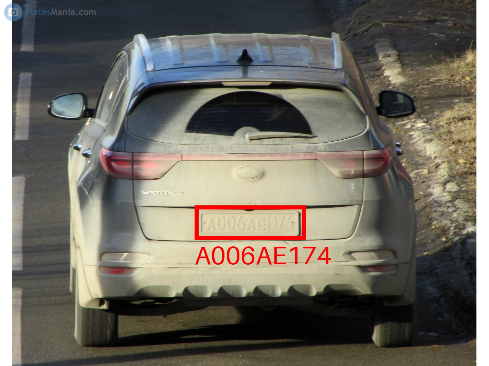

# Simple implementation of Automated License Plate Recognition

## Description

This project implements logic for ALPR training and primitive inference using a novel object detection
model, [D-FINE](https://github.com/Peterande/D-FINE/tree/master). 
The algorithm operates in the following steps:

1) Detect all possible license plates in the image

2) Extract the license plates

3) Run symbol recognition. Symbols are located and classified in one-shot using modified D-Fine architecture

4) Enjoy the results!

## Project Structure

### Overview

<pre>
├── data  
├── model
├── script
├── src
├── notebook.ipynb
└── README.md
</pre>

### Data

Place where all datasets and images are stored.
Contains too many files to be published on GitHub/GitLib,
provided upon a request.

<pre>
data
├── demo - images used in demos
├── yolo - original datasets in YOLO format
├── coco - the same YOLO datasets but in CoCo format
├── autocrop - license plate images cropped by the model
└── autorecognize - license plate symbols extracted by the model
</pre>

### Model

Directory with different models used in the project.
Currently only D-FINE is present.

<pre>
DFINE
├── configs
│   ├── dataset - dataset descriptions
│   └── dfine
│       └── custom
│           ├── plate_detection_n.yml - config for plate detection model (nano)
│           └── plate_recognition_n.yml - config for plate recognition model (nano)
└── output - checkpoints, training logs
</pre>

### Script

Various utility scripts used during training/inference.

<pre>
data
├── cocosplit.py - splits coco dataset into train and test parts
├── detect.py - detects the license plate
├── main.py - combines detect.py and recognize.py
├── recognize.py - recognizes symbols in the extracted license plate
├── recognize_correct.py - selects correct annotations
└── yolo2coco.py - converts YOLO dataset description to CoCo
</pre>

### Src

Source code for image loading, processing, geometry, dataset handling, etc.

<pre>
data
├── coco
├── util
└── box.py
</pre>